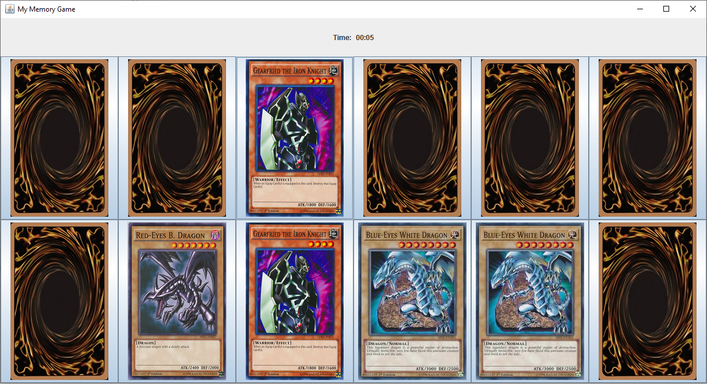
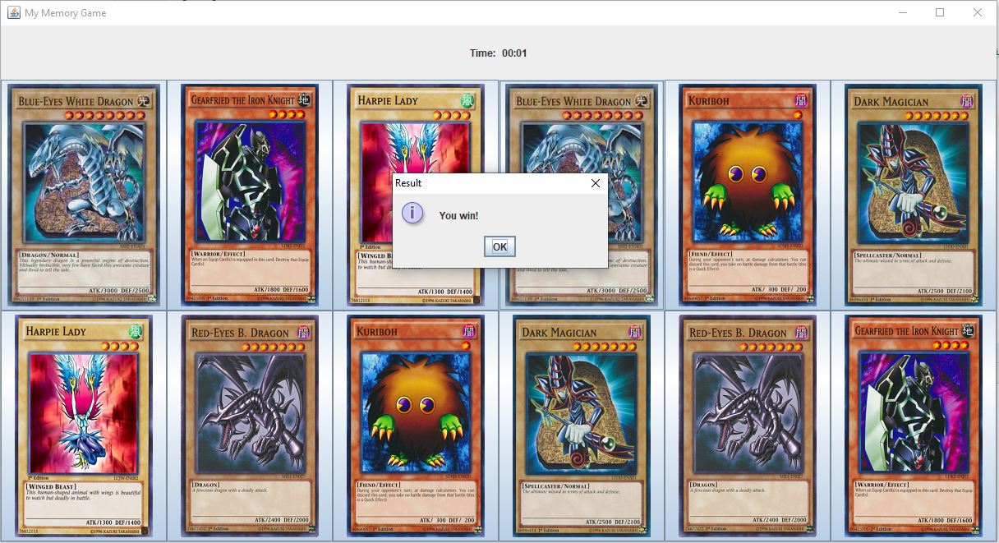

# Memory Game

#### Introduction.
The game consists of 12 Yugioh cards that are face down. The objective of the game is to match each picture with the corresponding picture and do so in a minimum amount of time. You can open two cards at a time. If they don't match they will automatically turn face down after 1 seconds. If they match, then they will be open in the board. The game ends when all the cards are matched.

### Development
1. Development tools: IntelliJ IDEA
2. JDK 1.8

### Screen shot

